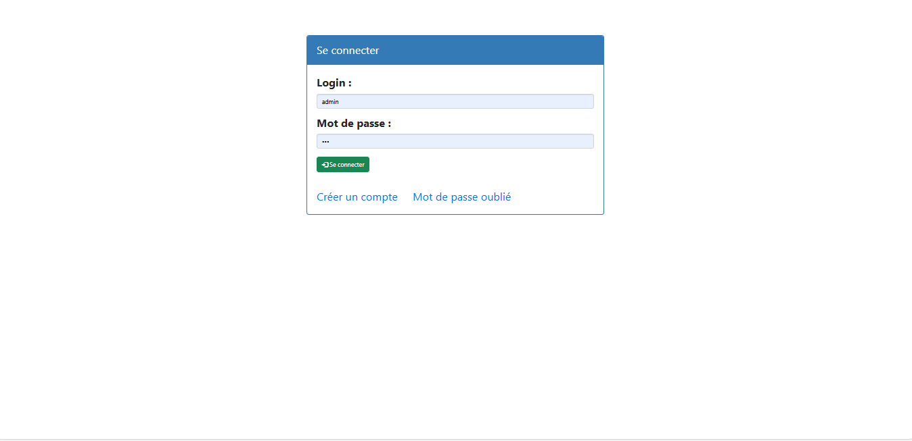
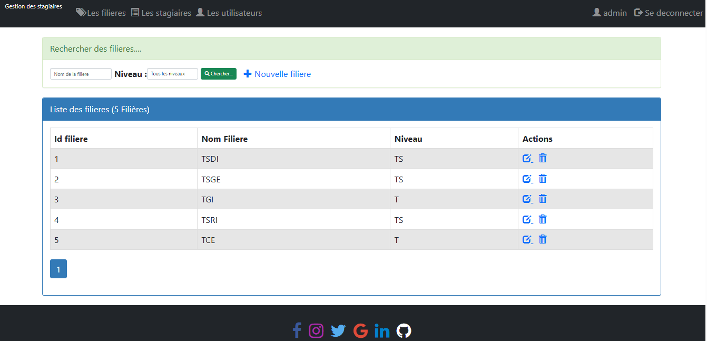
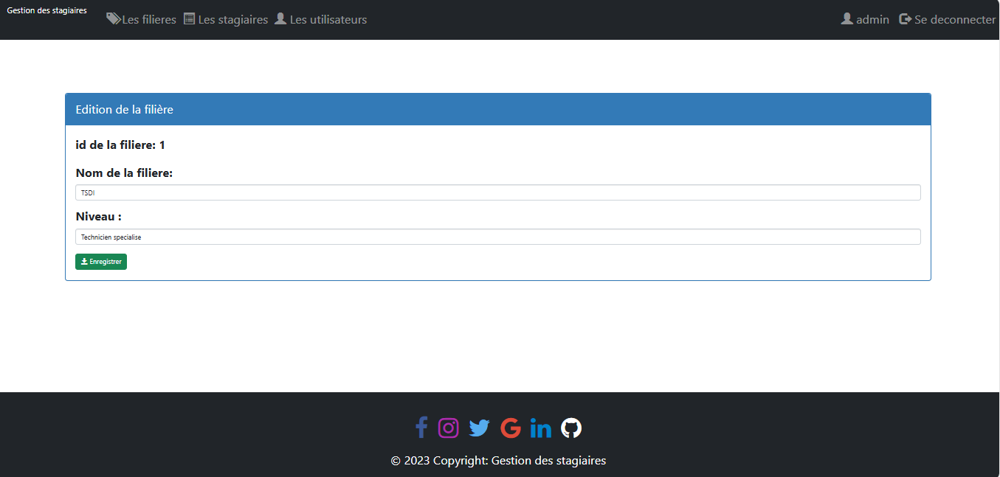
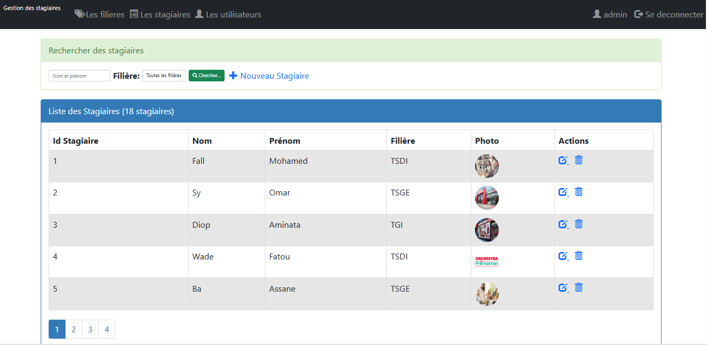
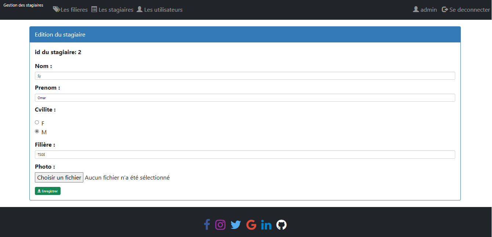
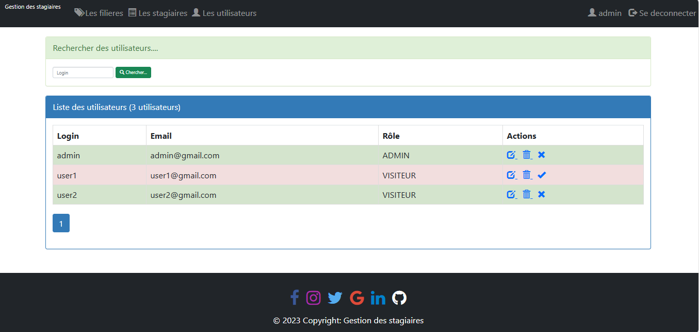

# Gestion des Stagiaires

## Description

**Gestion des Stagiaires**  est une application web que j'ai développée pour consolider mes connaissances en développement web. L'application permet de gérer les informations des stagiaires, incluant leur ajout, modification, et suppression. Ce projet utilise PHP pour la logique côté serveur et MySQL pour la gestion des données

## Objectifs du Projet

- **Consolidation des compétences en PHP et MySQL** : mise en pratique des connaissances en développement web.
- **Pratique du développement web complet** : création d'une application web avec une interface utilisateur et une gestion de base de données.

## Fonctionnalités

### 1. **Onglet Filières**

- **Affichage des Filières** : liste des différentes filières disponibles dans le système.
- **Recherche de Filières** : fonctionnalité de recherche pour trouver rapidement des filières spécifiques.
- **Gestion des Filières** : 
  - **Admin uniquement** : les administrateurs peuvent ajouter, modifier ou supprimer des filières.

### 2. **Onglet Stagiaires**

- **Affichage des Stagiaires** : liste des stagiaires avec leurs informations.
- **Recherche de Stagiaires** : fonctionnalité de recherche pour localiser un stagiaire spécifique.
- **Gestion des Stagiaires** : 
  - **Admin uniquement** : les administrateurs ont la possibilité d'ajouter, modifier ou supprimer des stagiaires.

### 3. **Onglet Utilisateurs**

- **Affichage des Utilisateurs** : liste des utilisateurs de l'application, incluant leurs adresses email.
- **Gestion des Rôles** : 
  - **Admin uniquement** : les administrateurs peuvent gérer les rôles des utilisateurs (Admin ou Utilisateur).

## Prérequis

Avant de commencer, assurez-vous d'avoir les éléments suivants installés sur votre machine :

- [PHP](https://www.php.net/downloads) (version 7.4 ou supérieure recommandée)
- [MySQL](https://dev.mysql.com/downloads/)
- Un serveur web (Apache, Nginx, etc.)

## Installation

### Cloner le Dépôt

Clonez ce dépôt sur votre machine locale :

```bash
git clone https://votre-repository-url.git
```

### Configurer la Base de Données

1. **Importer le Schéma de la Base de Données :**
Vous pouvez importer le fichier SQL via phpMyAdmin ou en ligne de commande :

- **Via phpMyAdmin** :
    1. Connectez-vous à phpMyAdmin.
    2. Cliquer sur "Nouvelle base de données" dans le menu de gauche.
    3. Allez dans l'onglet "Importer".
    4. Téléversez le fichier `base_de_donnees/base_de_donnees.sql` et lancez l'importation.

- **Via la ligne de commande** :
    ```bash
    mysql -u votre_utilisateur -p votre_base_de_donnees < base_de_donnes/base_de_donnees.sql
    ```

2. **Configurer les Paramètres de Connexion :**

   - Modifiez le fichier `connexionbd.php` pour inclure vos informations de connexion à la base de données :

     ```php
     <?php
     $host = 'localhost';
     $dbname = 'gestion_stagiaire';
     $username = 'votre_utilisateur';
     $password = 'votre_mot_de_passe';

     try {
         $pdo = new PDO("mysql:host=$host;dbname=$dbname", $username, $password);
      } catch(Exception $e) {
            die('Erreur de connexion:' .$e->getMessage());
       }
     ?>
     ```

3. **Démarrer le Serveur Web :**

   Utilisez un serveur local comme XAMPP, MAMP, ou LAMP pour exécuter votre application :

   ```bash
   php -S localhost:8000
   ```

   Accédez à `http://localhost:8000` pour voir l'application.

## Aperçu de quelques pages de l'application










